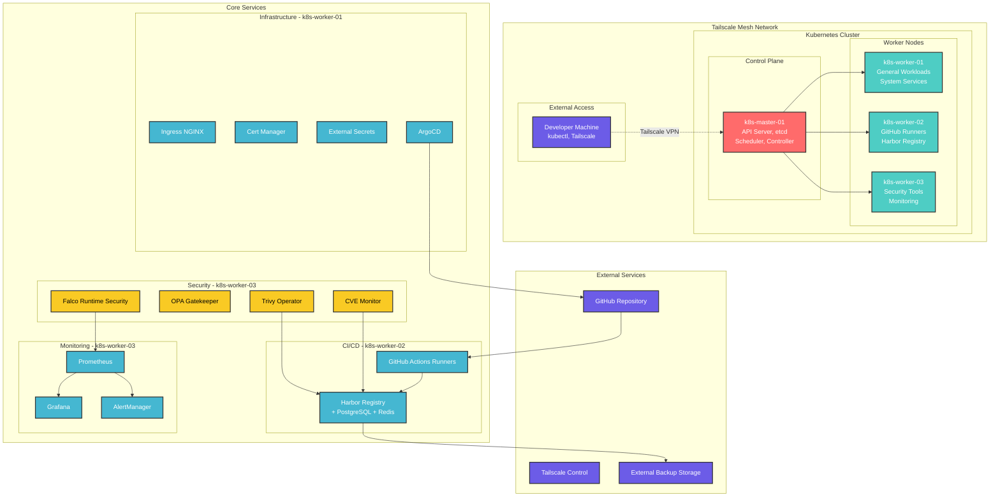
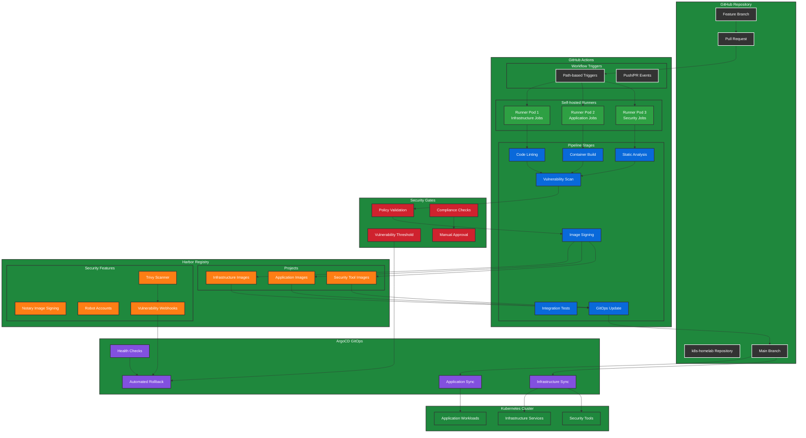
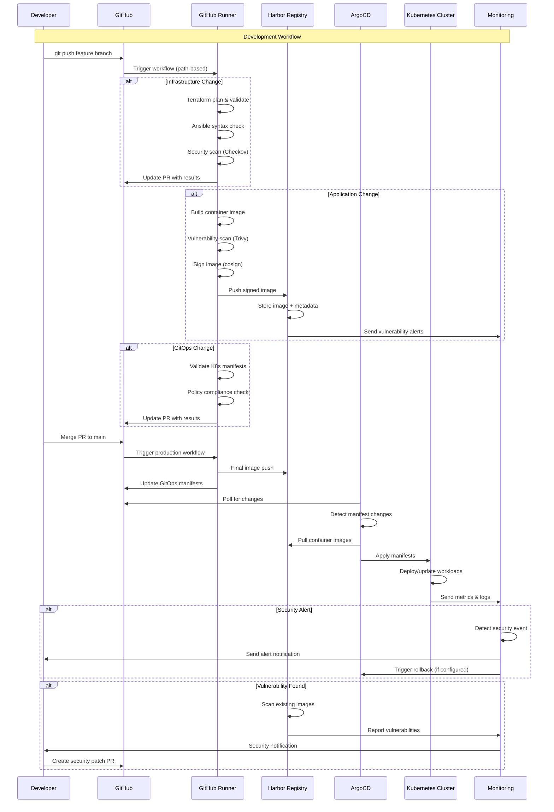

# `Kubernetes` Cluster Architecture

Technical architecture documentation for the secure `Kubernetes` homelab cluster.

## Table of Contents

*   [Repository Structure](#repository-structure)
*   [Cluster Architecture](#cluster-architecture)
*   [Network Architecture](#network-architecture)
*   [Security Architecture](#security-architecture)
*   [CI/CD Architecture](#cicd-architecture)
*   [Data Flow](#data-flow)

## Repository Structure

### Mono repo Organization

```
k8s-homelab/
├── infrastructure/
│   ├── terraform/
│   │   ├── environments/
│   │   │   ├── production/
│   │   │   │   ├── main.tf
│   │   │   │   ├── variables.tf
│   │   │   │   ├── outputs.tf
│   │   │   │   └── terraform.tfvars
│   │   │   └── staging/
│   │   │       ├── main.tf
│   │   │       ├── variables.tf
│   │   │       └── outputs.tf
│   │   ├── modules/
│   │   │   ├── compute/
│   │   │   │   ├── main.tf
│   │   │   │   ├── variables.tf
│   │   │   │   ├── outputs.tf
│   │   │   │   └── security.tf
│   │   │   ├── networking/
│   │   │   │   ├── main.tf
│   │   │   │   ├── variables.tf
│   │   │   │   ├── outputs.tf
│   │   │   │   └── security.tf
│   │   │   ├── security/
│   │   │   │   ├── main.tf
│   │   │   │   ├── variables.tf
│   │   │   │   ├── outputs.tf
│   │   │   │   └── policies.tf
│   │   │   └── storage/
│   │   │       ├── main.tf
│   │   │       ├── variables.tf
│   │   │       ├── outputs.tf
│   │   │       └── backup.tf
│   │   └── shared/
│   │       ├── providers.tf
│   │       ├── backend.tf
│   │       └── versions.tf
│   ├── ansible/
│   │   ├── inventories/
│   │   │   ├── production/
│   │   │   │   ├── hosts.yml
│   │   │   │   └── group_vars/
│   │   │   └── staging/
│   │   │       ├── hosts.yml
│   │   │       └── group_vars/
│   │   ├── roles/
│   │   │   ├── base-hardening/
│   │   │   │   ├── tasks/main.yml
│   │   │   │   ├── handlers/main.yml
│   │   │   │   ├── vars/main.yml
│   │   │   │   └── templates/
│   │   │   ├── kubernetes/
│   │   │   │   ├── tasks/main.yml
│   │   │   │   ├── handlers/main.yml
│   │   │   │   ├── vars/main.yml
│   │   │   │   └── templates/
│   │   │   ├── security-tools/
│   │   │   │   ├── tasks/main.yml
│   │   │   │   ├── handlers/main.yml
│   │   │   │   └── templates/
│   │   │   └── monitoring/
│   │   │       ├── tasks/main.yml
│   │   │       ├── handlers/main.yml
│   │   │       └── templates/
│   │   ├── playbooks/
│   │   │   ├── site.yml
│   │   │   ├── cluster-bootstrap.yml
│   │   │   ├── security-hardening.yml
│   │   │   ├── application-deployment.yml
│   │   │   └── maintenance.yml
│   │   └── group_vars/
│   │       ├── all.yml
│   │       ├── security.yml
│   │       ├── production.yml
│   │       └── staging.yml
│   └── helm-charts/
│       ├── infrastructure/
│       │   ├── ingress-nginx/
│       │   ├── cert-manager/
│       │   ├── external-secrets/
│       │   └── prometheus-operator/
│       └── security/
│           ├── falco/
│           ├── opa-gatekeeper/
│           ├── trivy-operator/
│           └── policy-engine/
├── applications/
│   ├── github-runners/
│   │   ├── k8s/
│   │   │   ├── base/
│   │   │   │   ├── deployment.yaml
│   │   │   │   ├── service.yaml
│   │   │   │   ├── configmap.yaml
│   │   │   │   └── kustomization.yaml
│   │   │   └── overlays/
│   │   │       ├── production/
│   │   │       └── staging/
│   │   ├── helm/
│   │   │   ├── Chart.yaml
│   │   │   ├── values.yaml
│   │   │   ├── values-production.yaml
│   │   │   └── templates/
│   │   ├── Dockerfile
│   │   ├── scripts/
│   │   └── README.md
│   ├── harbor-registry/
│   │   ├── k8s/
│   │   │   ├── base/
│   │   │   │   ├── deployment.yaml
│   │   │   │   ├── service.yaml
│   │   │   │   ├── pvc.yaml
│   │   │   │   ├── configmap.yaml
│   │   │   │   ├── secret.yaml
│   │   │   │   └── kustomization.yaml
│   │   │   └── overlays/
│   │   │       ├── production/
│   │   │       └── staging/
│   │   ├── helm/
│   │   │   ├── Chart.yaml
│   │   │   ├── values.yaml
│   │   │   ├── values-production.yaml
│   │   │   └── templates/
│   │   ├── config/
│   │   │   ├── harbor.yml
│   │   │   ├── database.yml
│   │   │   └── redis.yml
│   │   └── README.md
│   ├── monitoring/
│   │   ├── k8s/
│   │   │   ├── prometheus/
│   │   │   ├── grafana/
│   │   │   ├── alertmanager/
│   │   │   └── exporters/
│   │   ├── helm/
│   │   │   ├── Chart.yaml
│   │   │   ├── values.yaml
│   │   │   └── templates/
│   │   └── README.md
│   ├── security-tools/
│   │   ├── k8s/
│   │   │   ├── falco/
│   │   │   ├── trivy/
│   │   │   ├── opa-gatekeeper/
│   │   │   └── cve-monitoring/
│   │   ├── helm/
│   │   │   ├── Chart.yaml
│   │   │   ├── values.yaml
│   │   │   └── templates/
│   │   └── README.md
│   └── shared-charts/
│       ├── microservice/
│       │   ├── Chart.yaml
│       │   ├── values.yaml
│       │   └── templates/
│       ├── database/
│       │   ├── Chart.yaml
│       │   ├── values.yaml
│       │   └── templates/
│       └── monitoring/
│           ├── Chart.yaml
│           ├── values.yaml
│           └── templates/
├── gitops/
│   ├── clusters/
│   │   └── production/
│   │       ├── infrastructure/
│   │       │   ├── argocd/
│   │       │   │   ├── application.yaml
│   │       │   │   └── kustomization.yaml
│   │       │   ├── ingress-nginx/
│   │       │   │   ├── application.yaml
│   │       │   │   └── kustomization.yaml
│   │       │   ├── cert-manager/
│   │       │   │   ├── application.yaml
│   │       │   │   └── kustomization.yaml
│   │       │   └── monitoring/
│   │       │       ├── application.yaml
│   │       │       └── kustomization.yaml
│   │       ├── applications/
│   │       │   ├── harbor/
│   │       │   │   ├── application.yaml
│   │       │   │   └── kustomization.yaml
│   │       │   ├── github-runners/
│   │       │   │   ├── application.yaml
│   │       │   │   └── kustomization.yaml
│   │       │   └── custom-apps/
│   │       │       ├── application.yaml
│   │       │       └── kustomization.yaml
│   │       └── security/
│   │           ├── falco/
│   │           │   ├── application.yaml
│   │           │   └── kustomization.yaml
│   │           ├── opa-gatekeeper/
│   │           │   ├── application.yaml
│   │           │   └── kustomization.yaml
│   │           └── network-policies/
│   │               ├── policies.yaml
│   │               └── kustomization.yaml
│   ├── environments/
│   │   ├── production/
│   │   │   ├── kustomization.yaml
│   │   │   ├── namespace.yaml
│   │   │   ├── resource-quotas.yaml
│   │   │   └── network-policies.yaml
│   │   └── staging/
│   │       ├── kustomization.yaml
│   │       ├── namespace.yaml
│   │       ├── resource-quotas.yaml
│   │       └── network-policies.yaml
│   └── overlays/
│       ├── base/
│       │   ├── kustomization.yaml
│       │   └── common-labels.yaml
│       ├── production/
│       │   ├── kustomization.yaml
│       │   ├── replica-count.yaml
│       │   ├── resource-limits.yaml
│       │   └── security-context.yaml
│       └── staging/
│           ├── kustomization.yaml
│           ├── replica-count.yaml
│           └── resource-limits.yaml
├── .github/
│   ├── workflows/
│   │   ├── infrastructure.yml
│   │   ├── applications.yml
│   │   ├── gitops.yml
│   │   ├── security-scan.yml
│   │   └── dependency-update.yml
│   ├── ISSUE_TEMPLATE/
│   │   ├── bug_report.md
│   │   ├── feature_request.md
│   │   └── security_issue.md
│   └── security/
│       ├── SECURITY.md
│       ├── dependabot.yml
│       └── codeql-analysis.yml
├── docs/
│   ├── architecture/
│   │   ├── ARCHITECTURE.md
│   │   ├── networking.md
│   │   ├── security.md
│   │   └── disaster-recovery.md
│   ├── runbooks/
│   │   ├── deployment.md
│   │   ├── troubleshooting.md
│   │   ├── backup-restore.md
│   │   └── security-incident.md
│   └── security/
│       ├── threat-model.md
│       ├── security-policies.md
│       ├── compliance.md
│       └── attack-scenarios.md
├── scripts/
│   ├── setup/
│   │   ├── bootstrap-cluster.sh
│   │   ├── install-tools.sh
│   │   └── configure-tailscale.sh
│   ├── maintenance/
│   │   ├── backup.sh
│   │   ├── update-certificates.sh
│   │   └── rotate-secrets.sh
│   └── security/
│       ├── security-scan.sh
│       ├── penetration-test.sh
│       └── vulnerability-check.sh
├── .gitignore
├── README.md
├── SECURITY.md
└── LICENSE
```

## Cluster Architecture



## Network Architecture

```mermaid
graph TB
    subgraph "Internet"
        INET[Internet Traffic]
    end

    subgraph "Tailscale Mesh Network - 100.64.0.0/16"
        subgraph "Administrative Access"
            DEV[Developer Workstation<br/>100.64.1.10]
        end

        subgraph "Kubernetes Cluster Network"
            subgraph "Node Network - 192.168.1.0/24"
                M1[k8s-master-01<br/>192.168.1.10<br/>100.64.2.10]
                W1[k8s-worker-01<br/>192.168.1.11<br/>100.64.2.11]
                W2[k8s-worker-02<br/>192.168.1.12<br/>100.64.2.12]
                W3[k8s-worker-03<br/>192.168.1.13<br/>100.64.2.13]
            end

            subgraph "Pod Network - 10.244.0.0/16"
                subgraph "kube-system"
                    DNS[CoreDNS<br/>10.244.0.10]
                    CNI[Calico<br/>10.244.0.11]
                end

                subgraph "cicd-runners"
                    RUN[GitHub Runners<br/>10.244.1.0/24]
                end

                subgraph "cicd-registry"
                    REG[Harbor Registry<br/>10.244.2.0/24]
                end

                subgraph "security-monitoring"
                    SEC[Security Tools<br/>10.244.3.0/24]
                end

                subgraph "infra-monitoring"
                    MON[Monitoring Stack<br/>10.244.4.0/24]
                end
            end

            subgraph "Service Network - 10.96.0.0/16"
                K8S_API[Kubernetes API<br/>10.96.0.1:443]
                ING_SVC[Ingress Service<br/>10.96.1.100:80/443]
                REG_SVC[Harbor Service<br/>10.96.2.100:80/443]
                MON_SVC[Monitoring Services<br/>10.96.4.0/24]
            end
        end
    end

    subgraph "Network Policies"
        DEFAULT[Default Deny All]
        ALLOW_DNS[Allow DNS Resolution]
        ALLOW_API[Allow API Server]
        ALLOW_REG[Allow Registry Access]
        INTER_NS[Namespace Isolation]
    end

    %% Traffic Flow
    INET --> ING_SVC
    DEV -.->|Tailscale| M1
    DEV -.->|kubectl via Tailscale| K8S_API

    RUN --> REG_SVC
    SEC --> REG_SVC
    MON --> K8S_API

    %% Network Policy Enforcement
    DEFAULT -.-> RUN
    DEFAULT -.-> REG
    DEFAULT -.-> SEC
    DEFAULT -.-> MON

    ALLOW_DNS -.-> DNS
    ALLOW_API -.-> K8S_API
    ALLOW_REG -.-> REG_SVC

    %% Styling
    classDef nodeNet fill:#ff7675,stroke:#333,stroke-width:2px,color:#fff
    classDef podNet fill:#74b9ff,stroke:#333,stroke-width:2px,color:#fff
    classDef svcNet fill:#00b894,stroke:#333,stroke-width:2px,color:#fff
    classDef policy fill:#fdcb6e,stroke:#333,stroke-width:2px,color:#000
    classDef external fill:#6c5ce7,stroke:#333,stroke-width:2px,color:#fff

    class M1,W1,W2,W3 nodeNet
    class DNS,CNI,RUN,REG,SEC,MON podNet
    class K8S_API,ING_SVC,REG_SVC,MON_SVC svcNet
    class DEFAULT,ALLOW_DNS,ALLOW_API,ALLOW_REG,INTER_NS policy
    class INET,DEV external
```



## Security Architecture

```mermaid
graph TB
    subgraph "Security Layers"
        subgraph "Network Security"
            TS[Tailscale Mesh VPN]
            FW[Host Firewalls]
            NP[Network Policies]
            ISTIO[Service Mesh mTLS]
        end

        subgraph "Identity & Access"
            RBAC[Kubernetes RBAC]
            SA[Service Accounts]
            PSA[Pod Security Standards]
            OPA[OPA Gatekeeper]
        end

        subgraph "Runtime Security"
            FALCO[Falco Runtime Monitor]
            SELINUX[SELinux/AppArmor]
            SECCOMP[Seccomp Profiles]
            CAPS[Capability Dropping]
        end

        subgraph "Image Security"
            SCAN[Vulnerability Scanning]
            SIGN[Image Signing]
            ADMIT[Admission Controllers]
            QUARANTINE[Image Quarantine]
        end

        subgraph "Data Security"
            ETCD_ENC[etcd Encryption]
            SECRET_ENC[Secret Encryption]
            TLS[TLS Everywhere]
            BACKUP_ENC[Backup Encryption]
        end

        subgraph "Monitoring & Compliance"
            AUDIT[Audit Logging]
            ALERT[Security Alerts]
            COMPLIANCE[CIS Benchmarks]
            INCIDENT[Incident Response]
        end
    end

    subgraph "Security Boundaries"
        subgraph "Trust Zones"
            BLACK[Black - Ultimate Trust<br/>Dom0, Templates, Vault]
            GRAY[Gray - Full Trust<br/>Core Services, Builder]
            PURPLE[Purple - High Trust<br/>Management Tools]
            ORANGE[Orange - Low Trust<br/>Network Services]
            RED[Red - Untrusted<br/>External Traffic, USB]
        end
    end

    subgraph "Attack Simulation"
        REDTEAM[Red Team Exercises]
        GOAT[Kubernetes Goat]
        HUNTER[Kube-hunter]
        BENCH[Kube-bench]
    end

    %% Security Flow
    TS --> NP
    NP --> ISTIO
    RBAC --> SA
    SA --> PSA
    PSA --> OPA

    FALCO --> ALERT
    SCAN --> ADMIT
    SIGN --> ADMIT
    ADMIT --> QUARANTINE

    AUDIT --> COMPLIANCE
    ALERT --> INCIDENT

    REDTEAM --> FALCO
    GOAT --> ALERT
    HUNTER --> COMPLIANCE

    %% Styling
    classDef network fill:#ff7675,stroke:#333,stroke-width:2px,color:#fff
    classDef identity fill:#74b9ff,stroke:#333,stroke-width:2px,color:#fff
    classDef runtime fill:#00b894,stroke:#333,stroke-width:2px,color:#fff
    classDef image fill:#fdcb6e,stroke:#333,stroke-width:2px,color:#000
    classDef data fill:#e17055,stroke:#333,stroke-width:2px,color:#fff
    classDef monitor fill:#a29bfe,stroke:#333,stroke-width:2px,color:#fff
    classDef trust fill:#fd79a8,stroke:#333,stroke-width:2px,color:#fff
    classDef attack fill:#2d3436,stroke:#333,stroke-width:2px,color:#fff

    class TS,FW,NP,ISTIO network
    class RBAC,SA,PSA,OPA identity
    class FALCO,SELINUX,SECCOMP,CAPS runtime
    class SCAN,SIGN,ADMIT,QUARANTINE image
    class ETCD_ENC,SECRET_ENC,TLS,BACKUP_ENC data
    class AUDIT,ALERT,COMPLIANCE,INCIDENT monitor
    class BLACK,GRAY,PURPLE,ORANGE,RED trust
    class REDTEAM,GOAT,HUNTER,BENCH attack
```



## CI/CD Architecture



## Data Flow


